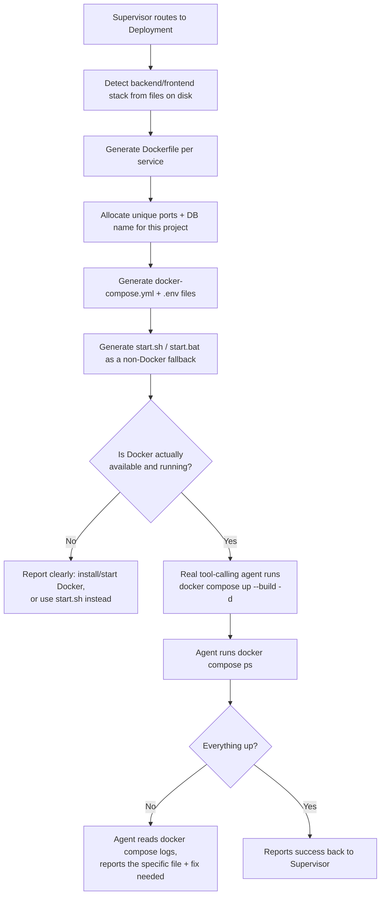

# How the Pipeline Deploys Projects to Docker Automatically

This document explains how `langgraph_pipeline` takes a finished backend + frontend + database and brings them up in Docker — **without the user ever writing a Dockerfile, a `docker-compose.yml`, or a connection string.**

The short version: **most of it is deterministic Python code, not an LLM decision.** Only the very last step — actually running the containers and diagnosing failures — is a real agent. That split is deliberate and is the core design idea worth understanding.

---

## 1. The two-part design

| Part | What it does | How it decides |
|---|---|---|
| **Asset generation** | Writes Dockerfiles, `docker-compose.yml`, `.env` files, port numbers, DB name | 100% deterministic Python (`skills/docker_skills.py`) — no LLM call, no randomness, same input always produces the same output |
| **Bring-up & diagnosis** | Actually runs `docker compose up`, checks what's running, reads logs on failure | A real LangGraph tool-calling agent (`capabilities/deployment.py`) — only invoked *after* Docker's availability is already confirmed |

This matters because it means the parts of deployment that must be *correct and reproducible* (port numbers, DB names, container wiring) never depend on an LLM getting creative — they're computed the same way every time. The agent is only responsible for the part that genuinely requires judgment: reading real `docker compose` output and deciding what's wrong.

---

## 2. Step by step: what happens when Deployment runs



### 2.1 Stack detection (deterministic)

Before anything Docker-related happens, the pipeline looks at what the Backend/Frontend agents actually wrote to disk and infers the runtime:

- **Backend**: `requirements.txt` present or any `.py` file → Python. Looks inside `requirements.txt` for `fastapi` / `flask` / `django` to pick the right start command and port.
- **Frontend**: `package.json` present → Node (reads its `scripts` block to find a `dev` or `start` script to run). No `package.json` → treated as static HTML/CSS/JS, served via nginx.

No LLM involved — just reading files that already exist.

### 2.2 Dockerfile generation (deterministic)

A Dockerfile is generated *per service*, matched to the detected stack. For this pipeline's actual fixed stack (Python/FastAPI backend, React/Vite frontend), it looks like:

```dockerfile
# backend/Dockerfile
FROM python:3.11-slim
WORKDIR /app
COPY requirements.txt .
RUN pip install --no-cache-dir -r requirements.txt
COPY . .
EXPOSE 8000
CMD ["uvicorn", "main:app", "--host", "0.0.0.0", "--port", "8000"]
```

```dockerfile
# frontend/Dockerfile
FROM node:20-alpine
WORKDIR /app
COPY package.json .
RUN npm install
COPY . .
EXPOSE 5173
CMD ["npm", "run", "dev", "--", "--host", "0.0.0.0"]
```

### 2.3 Per-project ports and database name (deterministic, collision-free)

Every project gets its own **stable, unique** set of host ports and its own Postgres database name, so multiple generated projects can run side by side without clashing:

- `allocate_ports(project_id)` — assigns backend/frontend/db host ports the first time a project is deployed, and remembers them (`output/.port_allocations.json`) so they stay the same across rebuilds.
- `db_name_for(project_id)` — turns the project ID into a valid, unique Postgres database name (e.g. `db_build_a_full_stack_notes_app`).

The **container-internal** ports stay fixed (8000, 5173, 5432) — only the **host-side** port mapping varies per project.

### 2.4 `docker-compose.yml` (deterministic)

Assembled from the pieces above. Notably:

- The frontend container is told the backend's address via `VITE_API_BASE_URL=http://localhost:<backend's real host port>` — never hardcoded, always the port that was actually allocated for *this* project. (This is the direct fix for an early bug where a hardcoded port silently broke frontend↔backend connectivity.)
- Postgres gets `schema.sql` mounted straight into `docker-entrypoint-initdb.d/`, so the database schema is applied automatically the first time the container starts — no manual migration step.
- Credentials are referenced as `${POSTGRES_USER}` etc., loaded automatically by `docker compose` from a generated `.env` file sitting next to it.

### 2.5 The `.env` files — this is the "no Postgres URL needed" part

Two `.env` files get written automatically:

- **Project root `.env`** — `POSTGRES_USER`/`PASSWORD` (reused from the pipeline's own credentials), the unique `POSTGRES_DB` name, and a full `DATABASE_URL` pointing at the `db` service by its Docker-network hostname.
- **`frontend/.env`** — `VITE_API_BASE_URL` pointing at the backend's real host port.

The user never types a connection string anywhere — it's constructed from `POSTGRES_USER`/`POSTGRES_PASSWORD` (set once, in the pipeline's own `.env`) plus the per-project name/port that was just allocated.

### 2.6 The non-Docker fallback (deterministic)

Alongside the Docker assets, the pipeline also generates **`start.sh`** and **`start.bat`** — plain local-process launchers (venv + `pip install` for the backend, `npm install` for the frontend) using the *same* allocated ports, for whenever Docker itself isn't installed or Docker Desktop isn't running. This is generated every time, not just as an error-path afterthought.

### 2.7 Docker availability pre-check (deterministic, before spending an LLM call)

Before ever invoking an agent, the pipeline checks — for free, no LLM involved:

```python
shutil.which("docker") is None       # is the CLI even installed?
subprocess.run(["docker", "info"])   # is the daemon actually running?
```

If either check fails, it reports a clear, specific message immediately (e.g. *"Docker Desktop isn't running — start it, or run `./start.sh` in the meantime"*) instead of burning an LLM call to have an agent guess at a cryptic connection error.

### 2.8 The actual bring-up (this is the agent)

Only once Docker is confirmed installed *and* running does a real tool-calling agent take over, with:

- **Tools**: `read_file`, `list_files`, and an **allowlisted terminal** (`run_command`) — restricted to exactly: `docker compose build`, `up`, `down`, `ps`, `logs`, `run`. Nothing else can execute (no shell chaining, no arbitrary commands).
- **No write access** — this agent verifies and deploys, it never patches application code itself.

Its job, in order:
1. Run `docker compose up --build -d`
2. Run `docker compose ps` to see what's actually running
3. If something failed, run `docker compose logs <service>` and read the relevant source file to find the *specific* cause
4. Report back: what's running, what failed, and the specific file + fix needed — which the Supervisor then routes back to whichever agent (Backend/Frontend) owns that file

---

## 3. Why split it this way

- **Correctness where it matters**: port numbers, DB names, and container wiring are the same every single time — no LLM hallucination risk on the part that absolutely must be right.
- **Judgment where it's needed**: interpreting `docker compose logs` output and tracing a failure back to a specific source file genuinely benefits from a model reading and reasoning, not a fixed script.
- **No wasted LLM calls**: the availability pre-check means "Docker isn't running" is caught instantly and for free, not diagnosed the expensive way.
- **Always a fallback**: `start.sh`/`start.bat` exist for every deployment, not just when Docker fails — so there's never a dead end.

---

## 4. Where this lives in the codebase

| File | Responsibility |
|---|---|
| `skills/docker_skills.py` | Stack detection, Dockerfile generation, `docker-compose.yml` generation, `.env` generation, port/DB-name allocation glue, `start.sh`/`start.bat` generation |
| `skills/project_registry.py` | `allocate_ports()`, `db_name_for()` — the actual per-project uniqueness logic |
| `capabilities/deployment.py` | Orchestrates the above, does the Docker-availability pre-check, and runs the real tool-calling deployment agent |
